# Python Block

## Проверка данных
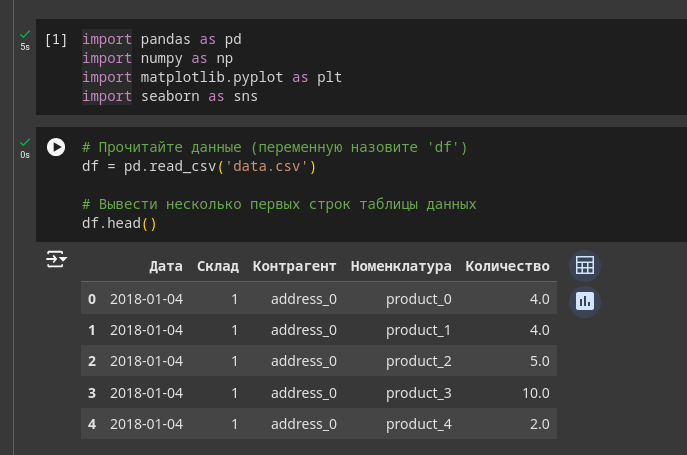

## Посмотрите формат таблиц
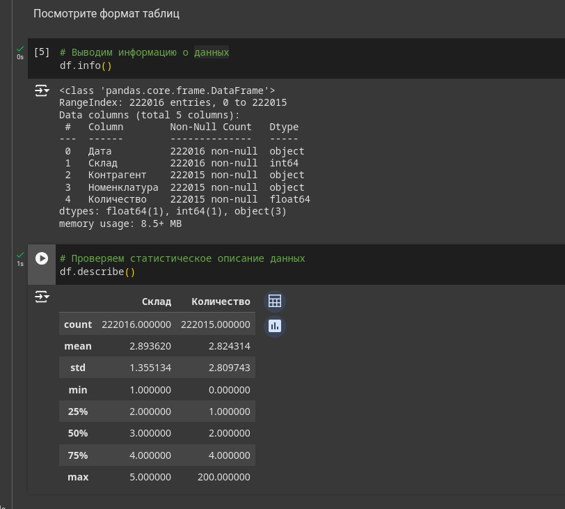

## Сразу переведем столбец "Дата" в правильный формат
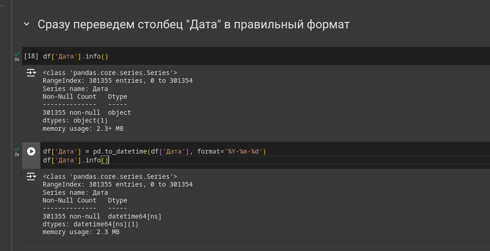

## Сгруппируйте данные по дате, посчитайте количество продаж
## Вывести несколько первых строк сгруппированных данных
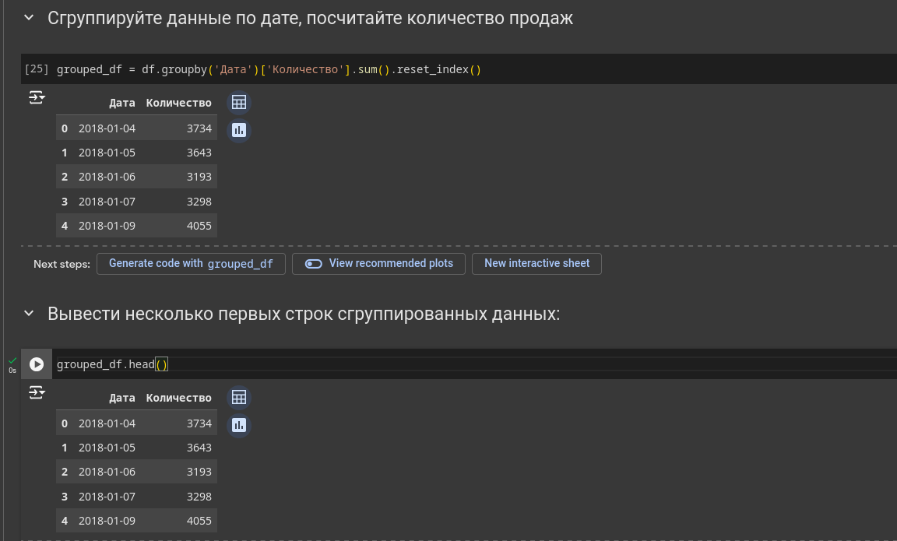

## Нарисуйте график продаж у `grouped_df`
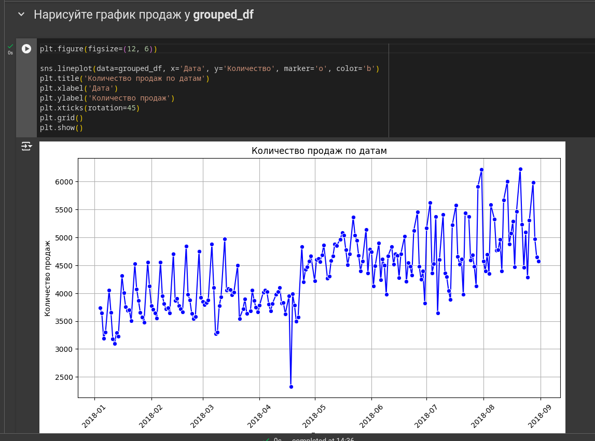

##  Опишите что вы видите на графике. Ваша задача - максимально описать график
- В январе и феврале количество продаж колеблется в пределах 3500–4000 единиц.
- В марте начинается заметный рост, достигающий пиков до 5000 единиц.
- В апреле наблюдается снижение продаж с падением к уровню около 3500 к концу месяца.
- В начале мая продажи резко снижаются до минимума около 2500 единиц.
- С середины мая начинается постепенный рост, достигая 5000 единиц к концу июня.
- В июле и августе продажи продолжают расти, достигая пиков в 5500–6000 единиц.

## Найдите строку, у которой максимальный выброс по количеству продаж (нужно найти выброс у `df`)
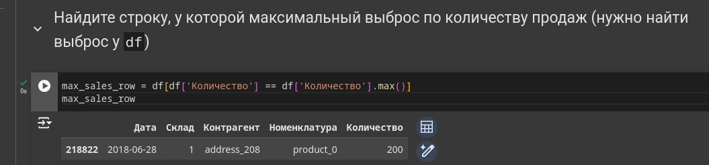

## Найдите топовый товар по продажам по средам за июнь, июль, август у 3 склада
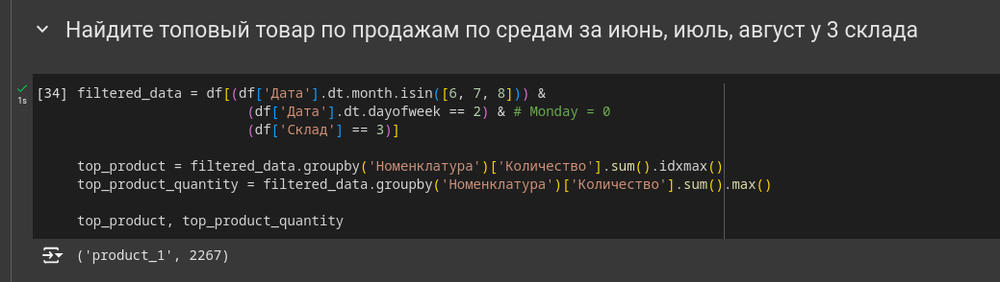

## Скачайте данные по погоде с https://rp5.ru/Архив_погоды_в_Астане (скачайте исходные данные, и далее преобразуйте так, чтобы мы имели Дату и Среднюю температуру за день)
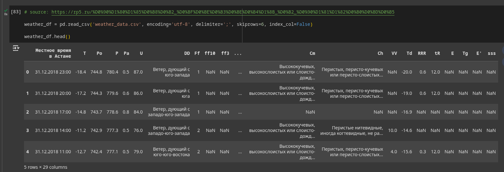

## объедините таблицу температуры с `grouped_df`
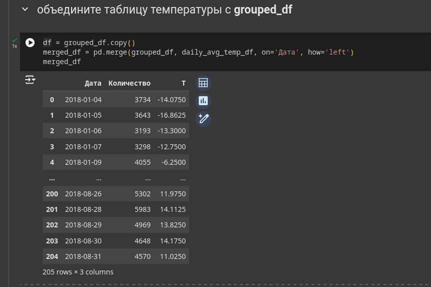

## Нарисуйте график `y=['Количество продаж', 'T']`, где Т это температура. А также отдельно график температуры.
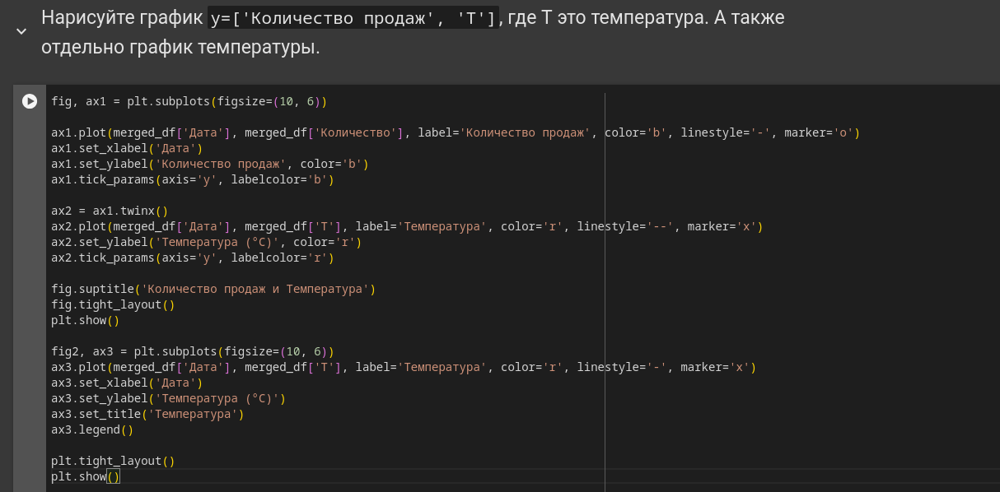
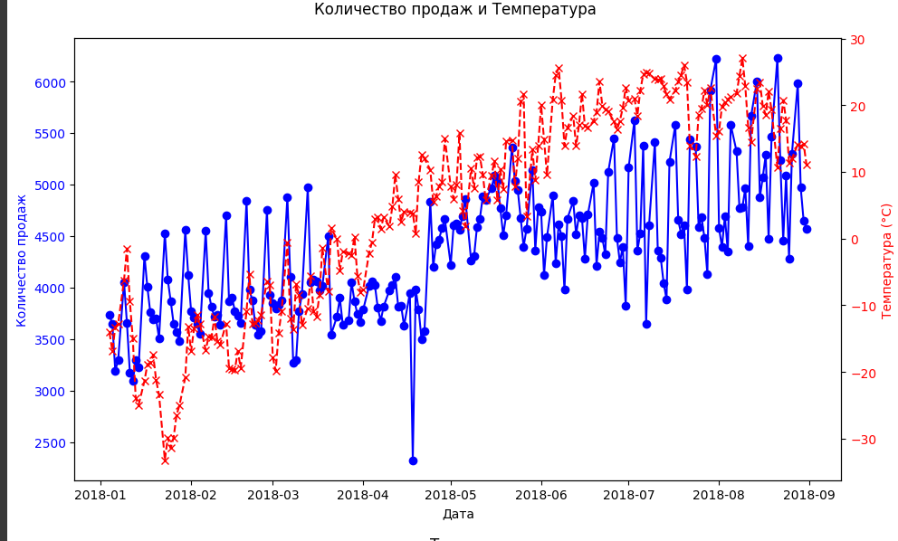
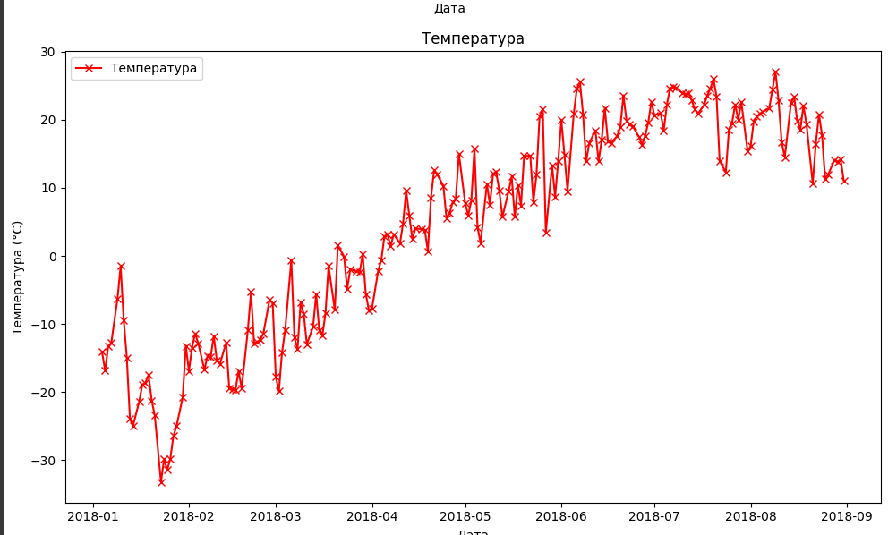
